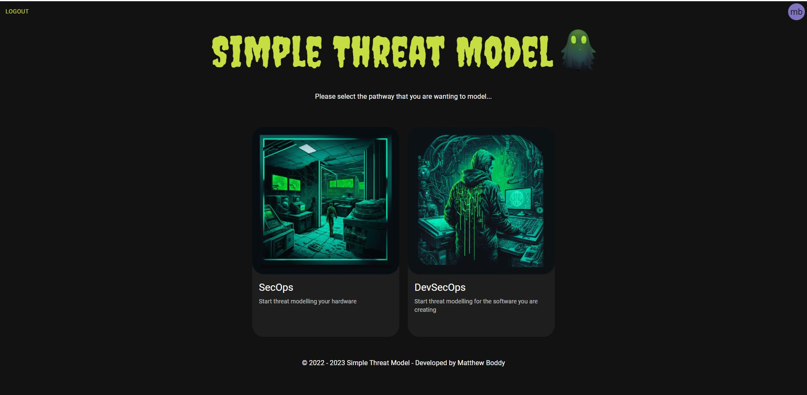
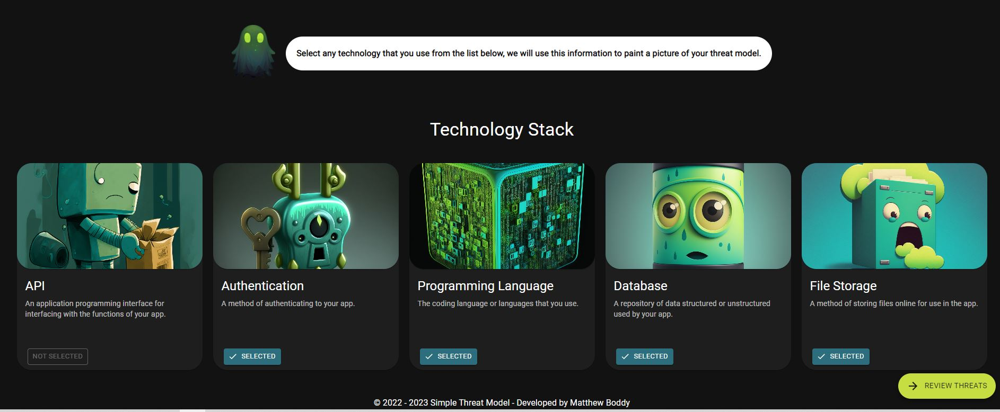
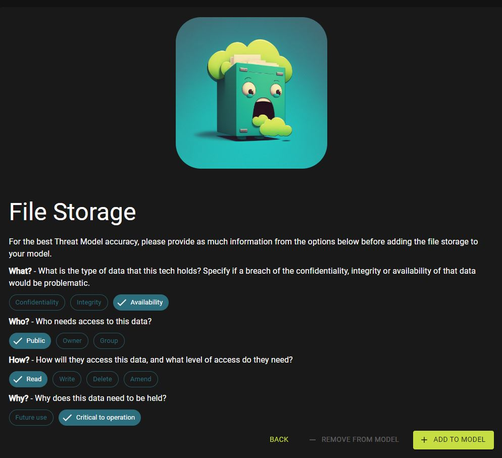
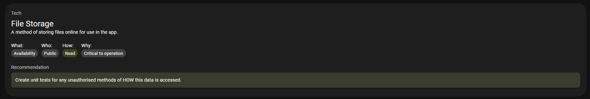

# Epic Threat Model
<!--  -->

This tool is in pre-alpha. There is no guarentee that the architecture of the Epic Threat Model is not itself vulnerable. There is also no guarentee that it will find all of the threats in the Threat Modelled environment. The only guarentee is that the tool (along with Fred the ghost) will do its very best to help wherever it can.  

## Intro
The Epic Threat Model is designed for Developers and Security Engineers to quickly identify security flaws in their cloud application implementation plans. It is designed to be quick to use so that the Threat Modeller can keep up with an Agile process releasing many times every day. It achieves this by doing away with data-flow-diagrams as well as some other aspects of Threat Modelling to keep the platform simple.

The Epic Threat Model is in alpha testing as it is still in the very early stages of development. Please report any bugs, vulnerabilities or security flaws here on Github.

## Start Threat Modelling
Anyone can sign up to get started with the Epic Threat Model right away at https://simple-threat-model.web.app/.

## How to use the tool
Hopefully the Epic Threat Model should be so simple that anybody can use it, but it is understandable that some might be weary about signing up to yet another platform. You can rest assured, the intention of the sign up isn't to capture data for marketing purposes, it just in place as a method of differentiating user data (i.e. Bob is shown Bob's Threat Model, Alice is shown Alice's Threat Model). The tool is created to use on Firebase, if you would like to spin up your own version of the tool, then you should have everything you need to do so, I will release instructions on how exactly you can do that soon.

## Step 1
Once you are logged in to the Threat Modelling tool, you are presented with a choice, would you like to model your SecOps (i.e. your operational technology), or DevSecOps (i.e. your development environment). SecOps is not active at the moment, but it will be coming soon, so select DevSecOps to move onto step 2. 

## Step 2
This is where the action happens. 

In front of you is a list of technologies that you might be using in your epic, story, task, project or feature. Each technology type is clickable, select a technology you will use and you will be presented with a series of questions about that technology that will assist the model.

The screenshot below shows a technology being filled with multiple choice answers helping the Threat Model to understand the data it holds. More about the What, Who, How and Why is discussed under the heading below. 

Once all of the relevant technology is added to the model, select `Review Threats` to navigate to the next page and final step. 

## Step 3

Now you are presented with a set of recommendations to help keep your data safe within your chosen tech stack. The image below shows an example recommendation suggesting to ensure any file storage is behind a load balancer to cater for surges in traffic volume. It follows that by proposing that denial of service attacks are dealt with through the use of a Web Application Firewall. 

After the recommendations, a list of 2022's top 25 CWE's that affect your chosen programming language are displayed, as a reminder of what to look out for during code design and review. 

## What, Who, How and Why
To gather relevant data that would otherwise be collected in a Data Flow Diagram (DFD), the Epic Threat Model asks 4 questions of the technology that holds data, what, who, how and why. By having a structured answer to these, some information about the data and how it is accessed is then understood by us. This allows for an interpretation of how the data could be maliciously accessed, in a similar way to a DFD.

